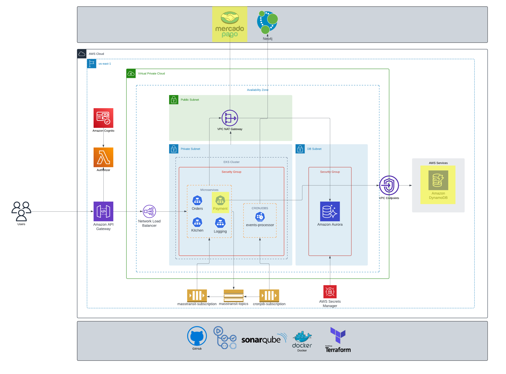
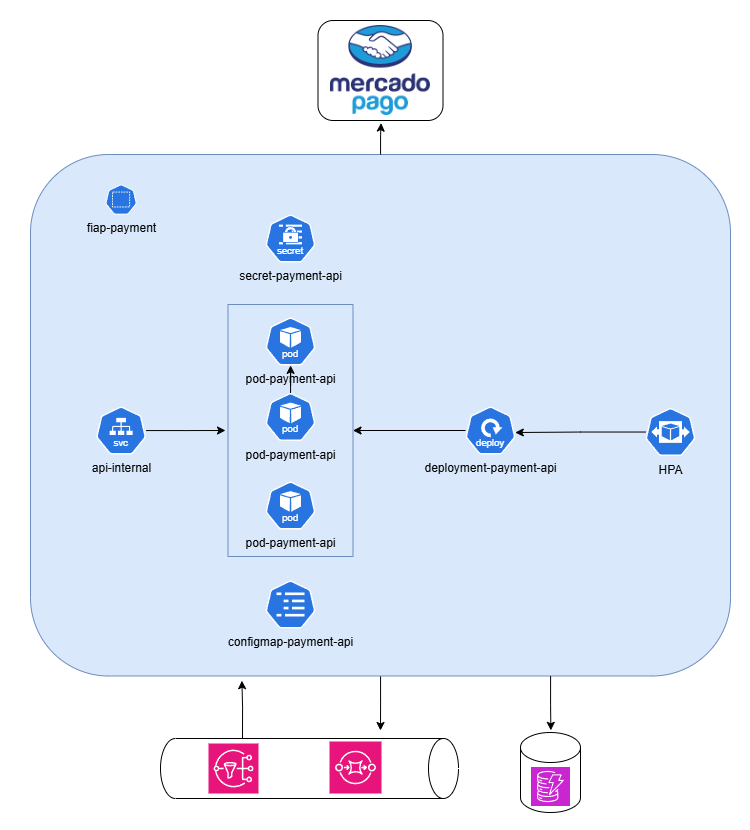

## Overview

[](https://sonarcloud.io/summary/new_code?id=soat-fiap_bmb.payment)
[](https://sonarcloud.io/summary/new_code?id=soat-fiap_bmb.payment)

This project, `bmb.payment`, is the payment microservice for a fast food application. It provides a simple API that allows users to create payments and integrates with various payment service providers to handle payment creation and receive payment status notifications. Additionally, it integrates with other domain microservices through messaging using MassTransit.

## Features

- **Payment Creation**: Easily create payments through a simple API.
- **Payment Integration**: Integrates with MercadoPago payment service provider.
- **Payment Notifications**: Receives and processes payment status notifications.
- **Microservice Communication**: Uses MassTransit for messaging between domain microservices.

### Database
It uses DynamoDB as database to store payment information, taking advanatge on nosql databases so onboarding new payment providers will need less overthinking due to its schema flexibility.

### Masstransit
It uses Masstransit to manage communication between services. Masstransit automatically creates Topics, Queues and Subscriptions.

## Getting Started

### Prerequisites

- [.NET Core](https://dotnet.microsoft.com/download)
- [MassTransit](https://masstransit-project.com/)
- [Docker](https://www.docker.com/) (optional, for containerization)

### Installation

1. Clone the repository:
    ```sh
    git clone https://github.com/soat-fiap/bmb.payment.git
    ```
2. Navigate to the project directory:
    ```sh
    cd bmb.payment
    ```
3. Restore dependencies:
    ```sh
    dotnet restore
    ```

### Running the Application

To run the application locally, use the following command:
```sh
dotnet run
```

### Docker Support

To run the application in a Docker container:
1. Build the Docker image:
    ```sh
    docker build -t bmb.payment .
    ```
2. Run the Docker container:
    ```sh
    docker run -d -p 5000:80 bmb.payment
    ```

## Usage

### API Endpoints

- **Create Payment**: `POST /api/payments`
- **Get Payment Status**: `GET /api/payments/{id}/status`

### Example Request

### Prerequisites
- Docker with Minikube configured
- [webhook.site](https://webhook.site) token

#### To forward mercado pago webhook notifications to host
```bash
whcli forward --token=f513d4a6-4dbd-4e32-93f5-b35376f33c89 --target=http://localhost/api/notifications/mercadopago
```

```sh
curl -X POST "https://yourapiurl/api/payments" -H "accept: application/json" -H "Content-Type: application/json" -d "{ \"amount\": 100.0, \"currency\": \"USD\", \"paymentMethod\": \"CreditCard\" }"
```
  ## This repo on the infrastructure
  
  

  ### K8S
  